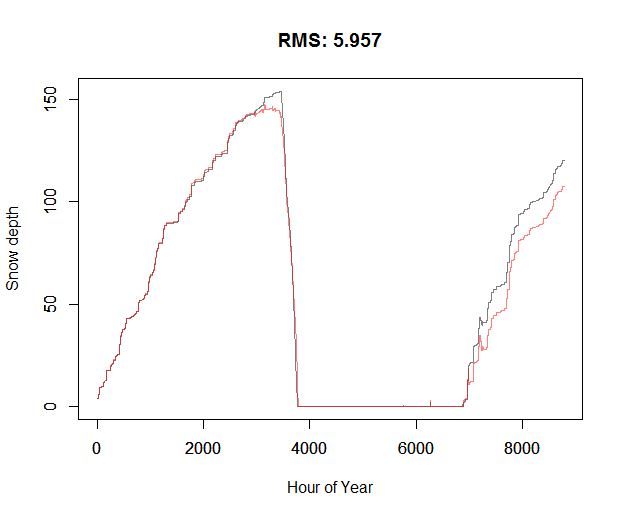
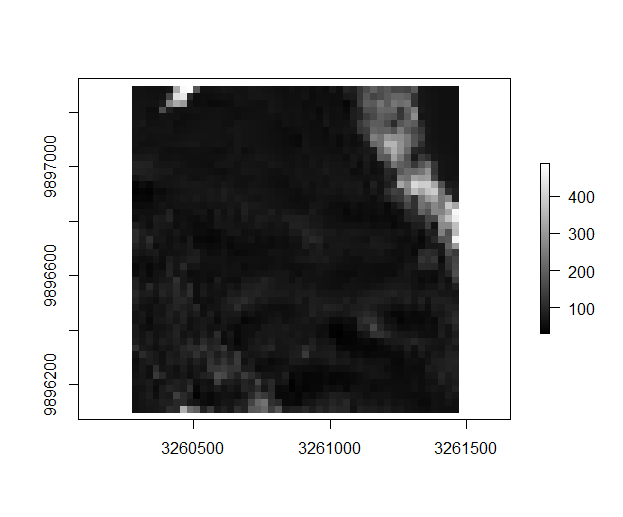
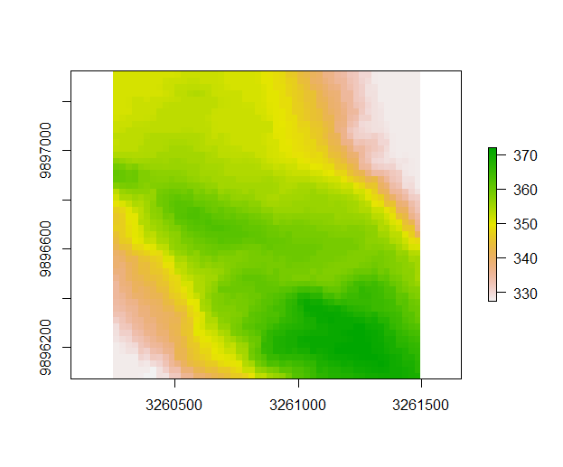
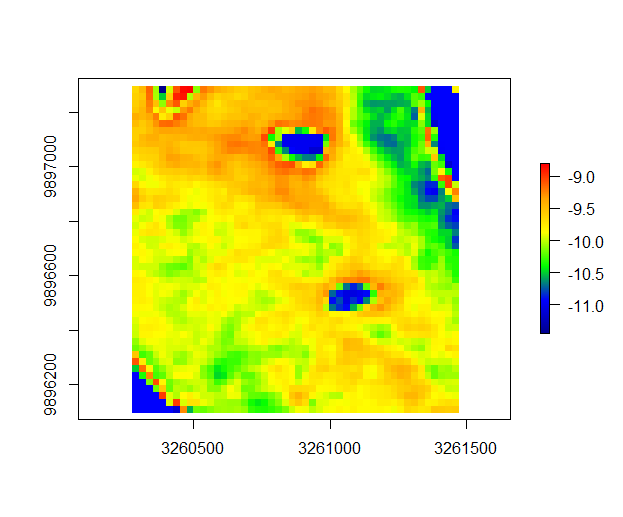

```{r, include = FALSE}
knitr::opts_chunk$set(
  collapse = TRUE,
  comment = "#>"
)
```
* [Overview](#overview)
* [Quick start](#quick-start)
* [Model inputs](#model-inputs)
  + [Meteorological data](#meteorological-data)
  + [Vegetation parameters](#vegetation-parameters)
  + [Other variables](#other-variables)
  + [Optional variables](#optional-variables)
* [Fitting the snow model](#fitting-the-snow-model)
  + [Fitting soil moisture](#fitting-snow-temperature)
  + [Fitting soil temperature](#fitting-snow-depth)
* [Preparing model inputs](#preparing-model-inputs)
* [Running the model](#running-the-model)
  + [Point model](#point-model)
  + [Spatial model](#spatial-model)
  + [Snow microclimate](#snow-microclimate)

## Overview
This vignette describes the R package ‘microsnow’. The package contains a series of functions for predicting snow dpeth and temperature and microclimatic conditions above and below canopy when snow is present on the ground. It is the snow component of the `microclimf` package, but can also be used as a stand-alone model. 

It starts by using a simple model emulator to estimate, for a point location, snow temperature, the rate of snow melt as a function of snow and air properties, and resultantly the snow budget. The emulator is fitted using field measurements or the outputs of a more complex, and a wrapper function for the NicheMapR snow model (https://mrke.github.io/) is included with the package. These parameters are then used to model snow spatially at daily time-intervals, optionally allowing snow melt to vary spatially, and distributing snow on the ground using a topographic positioning index. Interception of snow by the canopy is also computed.

Microclimate air temperatures and relative humidity are then computing using energy balance equations, as in `microclimf`, except
that snow surface temperature instead of ground surface temperature is used. 

It best applied at high-resolution over small areas, as snow fall and weather variables are  assumed spatially uniform, and the computation of snow melt, relies on computing solar radiation using a single latitude and longitude. 

## Quick start
Here I provide brief instructions for how to run `microsnow` for those broadly familiar with microclimate modelling, in particular the `microclimf` package. Four sets of input variables are needed: (1) a dataset of hourly weather, (2) a vector of daily rainfall, (3) a digital elevation dataset and (4). It is best if  datasets  have exactly the same format and units as the example datasets included with the package. The spatial resolution and extent of outputs is determined by the spatial resolution of the digital elevation dataset, and the spatial datasets of vegetation parameters should also match the digital elevation dataset in terms of resolution and extent. However, there is some flexibility in this regard (see below).

In the code below, outputs from `NicheMapR` are used in place of field measurements to fit the parameters for the model emulator. These are then derived and the snow model run to provide estimates of snow depth and temperature. Finally, the microclimate model is run using default input datasets included with the package to derive estimates of temperature and relative humidity at a specified height above ground. The microclimate model can also be run without first runnign the snow model: it is called automatically if not run. Both the snow model and the microclimate model take a little while to run.

```{r eval=FALSE}
library(microsnow)
library(terra)
library(NicheMapR)
# Derive estimates of snow melt temperature parameters using NicheMapR
nmrout<-runNMRSnow(climdata,precd,66.215,29.293,ALTT = 360)
# Derive model emulator coefficients for snow temperature
STparams<-fitsnowtemp(climdata,precd,nmrout$SNOWDEP,nmrout$SNOWTEMP)
# Derive melt factor coefficient and compare estimated snow depth 
# (red = NicheMapR output, black = model emulator)
meltfact<-fitsnowdepth(climdata,nmrout$SNOWDEP,precd,STparams=STparams)$meltfact
# Run snow model with defaults, but allowing spatially variable snow melt (takes ~100 seconds)
sda<-modelsnowdepth(climdata,precd,nmrout$SNOWDEP,dtm,pai,hgt,STparams,meltfact,spatialmelt = TRUE)
# plot mean snow depth
msnowdep<-apply(sda$gsnowdepth,c(1,2),mean)
rsnowdep<-raster(msnowdep,template=dtm)
plot(rsnowdep,col = gray(0:255/255))
# Compare to dtm
plot(dtm)
# Run microclimate model for 01m above ground and plot air temperature for 1st Jan (midday)
microsnowout<-runmicrosnow(climdata,precd,0.1,dtm,pai,plai=0.3,hgt,x=1,sda=sda,STparams=STparams,spatialmelt = TRUE)
temps<-raster(microsnowout$Tz[,,13],template=dtm)
mypal <- colorRampPalette(c("darkblue","blue","green","yellow","orange","red"))(255)
plot(temps,col=mypal)
```

The code generates the figures below. In the first, comparisons of the provided (red) and model-emulated (black) estimates of snow dpeth are plotted by default by the function `fitsnowdepth`. In the second,
mean snow depth (cm) is shown, indicating the accumulation of snow in topographic hollows. In the third, the `dtm` is plotted for context. In the final plot, air temperature at the user-specified 0.1m above ground at midday on 1st Jan is shown.

\
\
\
\

## Model inputs
In addition to a digital elevation dataset, two sets of parameters are needed to run the model: (i) standard hourly meterological climate-forcing variables (and daily rainfall) representative of macroclimatic conditions across the study site, in the form of a data.frame with single values for each hour. (ii) A suite of parameters describing properties of the canopy in the form of high-resolution gridded values (though single values for some can be provided instead)

### Meteorological data
The inbuilt data,frame `climdata` gives an example of the hourly meteorological variables needed to run the model:

```{r}
library(microclimf)
head(climdata)
```
The data frame contains the following columns: `obs_time` – POSIXlt object of observation times for each climate variable, `temp` – temperatures (deg C), `relhum` - relative humidity (percentage), `pres` - atmospheric pressure (kPa), `swrad` - total shortwave radiation received by a horizontal surface (W/m^2), `difrad` - diffuse radiation (W/m^2), `skyem` sky emissivity (range 0 to 1), `windspeed` - wind speed at reference height (m/s). 

Any input weather dataset provided, must use the same format, column names and units as in this example dataset. Most of these are standard meteorology variables that are readily available globally. If unknown for the study area, users may wish to explore the `mcera5` package on github (https://github.com/everydayduffy/mcera5) or the `hourlyNCEP` function available in the microclima package (https://github.com/ilyamaclean/microclima).  Diffuse radiation, is sometimes harder to come by as many standard weather stations only estimate total radiation. If unknown, it can be estimated using the `difprop` function in the microctools package (https://github.com/ilyamaclean/microctools). The microctools package, also contains a function `converthumidity`, for converting absolute or specific humidity or vapour pressure to relative humidity.  

In addition to the above data frame of hourly weather variables, a vector of daily precipitation values is also required. 

### Vegetation parameters
The following vegetation variables are needed:

(1) `pai` plant area index. This can be supplied as a single numeric value, e.g. 0, which may be useful in open areas with short vegetation where vegetation has a minimal effect on snow. It can also be supplied as a raster dataset, in which case the resolution and extent of the raster must match `dtm`. Alternatively, it can be permitted to vary through time and supplied as a 3D array, with third dimension representing time. if `dim(pai)[3] != length(weather$temp)` then the time intervals in pai are assumed equally spaced. I.e. if 12 values are supplied and `weather` contains a year of data, the values are assumed to be approximately monthly. The model handles this automatically.

(2) `plai` the proportion of `pai` that is leaves (such that `plai*pai=lai` where lai is the leaf area index). Can be supplied as a single numeric value, raster or array of values as with `pai`.

(3) `x` the ratio of ratio of vertical to horizontal projections of leaf foliage as described in Campbell (1986) Agricultural and Forest Meteorology, 36:317-321. It is used for modelling radiation through canopies. Woodland and forest, particularly in winter, tend to have values close to 1. Can be supplied as a single numeric value, raster or array of values as with `pai`.

(4) `lw` the average size of leaves. Can be supplied as a single numeric value or a raster. Leave as the default value for bare deciduous canopies in winter. 

(2) `hgt` vegetation height. This must be supplied as a high resolution raster dataset matching `dtm`

These parameters are used to determine the shape of the temperature and wind profiles above canopy, allowing these to vary as function of snow depth and temperature. They are also used to compute latent heat fluxes, radiation transmission and canopy snow interception.

### Other variables
(1) `dtm` a raster of elevations. The x, y and z dimensions of the raster should all be in metres and each grid cell should be square to ensure appropriate calculation of slope angles. The dataset is used to distribute snow spatially and to compute radiation intercepted by the snow surface.

(2) `reqhgt`. If running the microclimate component of the snow model, a single numeric value representing the height in metres for which microclimate is required. If, during any period, this lies below the snow surface, the temperature returned is that of snow and the relative humidity set at 100%.

### Optional variables
(1) `lat` and `long` are the latitude and longitude expressed in decimal degrees (negative for west of the Greenwich meridian). These are needed to compute solar angles and only single values are taken as inputs. In consequence if there is significant latitudinal variation across the study region then the model be run in tiles. If not supplied they are calaculated from `dtm`, necessitating that the coordinate reference system of `dtm` is specified.

(2) `snowenv` one of `Alpine`, `Maritime`, `Prairie`, `Taiga` or `Tundra`, representing the snow environment for which the model is run. These are used to compute snow densities following Sturm et al (2010) J Hydrometerology, 11:1380-1394. Default `Taiga`.

(3) `snowem` the typical thermal emissivity of the snow surface. Default 0.99.

(4) `zmin` a single numeric value representing the roughness length for momentum transfer of snow surface without vegetation protruding (m). Default 0.002 m.

(5) `umin` the minimum speed used for calaculation of heat conductance between the snow surface and air. If too low, conductance tends towards zero leading to unrealistically high or low temperature gradients. Default 0.5 m/s. 

(6) `astc` temperature (deg C) at which precipitation falls as snow. Default 1.5 deg C.

(7) `Sh` branch snow load coefficient. Following Hedstrom & Pomeroy (1998) Hydrol. Process. 12, 1611-25, canopy snow interception is partially determined the capacity for branches to hold snow. Typical values are 6.6 for pine and 5.9 for spruce.

(8) `zu` height above ground (m) of wind speed measurement in weather dataset. Default 2 m.

(9) longitude (decimal degrees) of local timezone meridian for `obs_time` values in the input weather dataset. E.g. -75 deg for EST. Default is 0 for UTC. Used for computation of solar position.

(10) `dst` optional numeric value representing the time difference from the timezone meridian (hours, e.g. +1 for British Summer Time if `merid` = 0). Default 0.

(11) `initdepth` single numeric value or matrix of initial snow depths at start of model run (m). Default 0.

## Fitting the snow model
